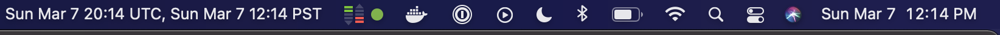

# clocks

[](https://github.com/tmc/clocks/releases/latest)
[](https://github.com/tmc/clocks/actions?query=workflow%3ATest)
[](https://goreportcard.com/report/tmc/clocks)
[](https://pkg.go.dev/github.com/tmc/clocks)

Command clocks places additional time zones into your Mac status bar.

## Installation

clocks is a [Go](https://golang.org/) program for MacOS systems.

Presming  you have a working Go insallation, you can install `clocks` via:

```console
go install github.com/tmc/clocks@latest
```

Note: You should have `$HOME/go/bin` on your shell's `PATH` so that `go install`ed binaries are directly executable.

## Usage

```console
$ clocks -h
Usage of clocks:
  -fmt string
    	time format string (golang time pkg) (default "Mon Jan 2 15:04 MST")
  -tzs string
    	time zones (default "UTC,America/Los_Angeles")
```

## Example Output

This is example output from running `clocks`:


